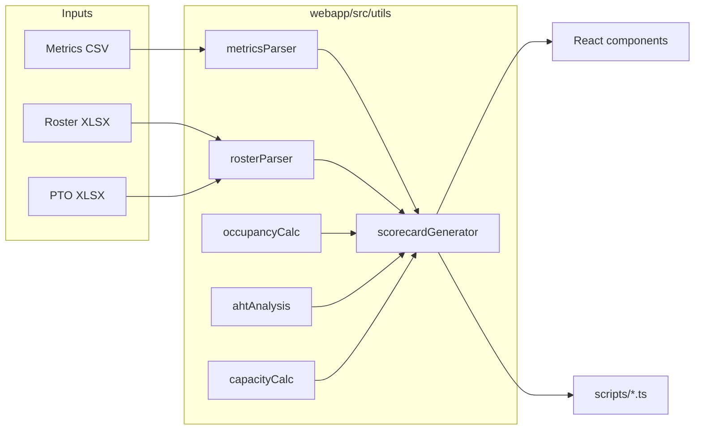

# RGM Performance Occupancy Calculator


Agent performance and occupancy calculator for dispatch / call-center teams. It joins a **daily roster** (Excel) with an **Amazon Connect–style Historical Metrics Report** (CSV, 30-minute agent intervals) and produces occupancy, AHT, capacity, PTO and scorecard views.

This is a reference project with **fully synthetic sample data**, so anyone can fork it, study the data model and adapt it to their own team.

> Author: **Nalin Heinrich** ([@nalinheinrich](https://github.com/nalinheinrich)) · MIT License

---

## 🎯 Problem

A dispatch floor needs to know, every half-hour, whether available agents are actually busy. The metrics export gives occupancy per agent per interval, but not joined to the schedule: who was rostered, their baseline AHT, their cross-training, or who was on PTO. Managers end up stitching two files together by hand. This tool does the join and the math the same way every time.

## ✨ Features

- **Occupancy %** per agent, per interval and per team, matching the public Amazon Connect definition: contact ÷ (contact + idle)
- **Capacity / productive %** and a breakdown of all 12 non-productive categories
- **AHT tracking**: contact-weighted actual AHT vs the roster's `AHT (min)` baseline, with a tolerance flag
- **Interval heatmap**: agent × 30-minute occupancy grid
- **Team comparisons** by roster role, routing profile, hierarchy (Tenured / Lead / New Hire) and cross-training
- **PTO adjustments**: capacity removed by each PTO window
- **Roster ↔ metrics join report** and **shrinkage**
- **Policy violations**: daily break, lunch and personal totals over limit
- **CSV export** of scorecards and interval summaries
- **CLI scripts** for the same calculations without the UI, plus a reproducible synthetic-data generator
- All processing is local (browser or Node); no data is sent anywhere

## 📊 Sample output (synthetic data)

```
┌──────────────────────────────┬───────────┐
│ Rows (after filters)         │ 244 / 272 │
│ Agents scored                │ 19        │
│ Team occupancy               │ 79.76 %   │  Moderate (target 85 %)
│ Productive % (capacity)      │ 80.93 %   │
│ Contacts handled             │ 2,758     │
│ Weighted AHT                 │ 100.7 s   │
│ Intervals with SL ≥ 90 %     │ 91.9 %    │
│ Busiest interval             │ 10:00 → 89.5 %
│ Quietest interval            │ 15:30 → 71.8 %
│ Shrinkage (planned 18)       │ 11.1 %    │
└──────────────────────────────┴───────────┘
```

Screenshots: _placeholder. Add `docs/images/dashboard.png`, `scorecards.png`, `heatmap.png` after running `npm run dev`._

## 🧮 Key formulas

```
Non-Productive      = Σ 12 aux columns (Manager Approved, Training, Break, Huddle, Personal,
                      Meeting, Project, Lunch, Lead Approved, Leadership Approved,
                      Unproductive, Engagement)
Occupancy %         = Agent on contact time ÷ (Online time − Non-Productive) × 100
Productive Minutes  = (Online time − Non-Productive) ÷ 60
Capacity %          = (Online time − Non-Productive) ÷ Online time × 100
AHT (min)           = Σ(AHT sec × contacts) ÷ Σ contacts ÷ 60
Contacts / hour     = Σ contacts ÷ online hours
SL compliance %     = intervals with SL(20 s) ≥ 90 % ÷ intervals with SL
Shrinkage %         = (Active on roster − Active seen in metrics) ÷ Active on roster × 100
```

Group values are ratios of sums, never averages of percentages. Derivations and worked examples: [docs/formulas.md](docs/formulas.md).

Worked example (`caswhit`, 16:30–17:00): online 1,800 s, break 872 s + personal 245 s → available 683 s; contact 411 s → **60.18 %**.

## 🗂️ Data model

```
Daily Roster (xlsx)                 Historical Metrics (csv)
┌──────────────────┐               ┌──────────────────────────┐
│ Alias ◄──────────┼───────────────┼─► Agent                  │
│ Name             │               │ Agent Hierarchy Level Two│
│ Role             │               │ Routing Profile          │
│ Shift            │               │ StartInterval/EndInterval│
│ Start / End      │               │ Online time              │
│ AHT (min) ◄──────┼── compare ────┼─► Average handle time    │
│ Break 1/Lunch/B2 │               │ 12 aux columns           │
│ Cross Trained    │               │ Agent on contact time    │
└──────────────────┘               │ Occupancy                │
                                   │ Service level 20 seconds │
PTO Associates (xlsx)              │ Contacts handled         │
┌──────────────────┐               └──────────────────────────┘
│ Alias ◄──────────┼── same key
│ PTO Times / Hours│── reduces scheduled capacity
│ Adjusted Start   │
└──────────────────┘
JOIN KEY: Alias (roster) = Agent (metrics), case-insensitive
```

```
┌─────────────────────────────┬──────────────────────────────────────────┐
│ Synthetic sample            │ Size                                     │
├─────────────────────────────┼──────────────────────────────────────────┤
│ Daily Roster                │ 20 fictional agents × 12 columns         │
│   Standing = Active         │ 18 (2 Extra Time helpers blank)          │
│ PTO Associates              │ 4 rows × 7 columns                       │
│ Historical Metrics          │ 272 rows × 24 columns, 20 agents         │
│   interval starts           │ 09:00 – 16:30 on 2026-01-15              │
│ Roster ∩ Metrics            │ 18 (2 roster-only, 2 metrics-only)       │
└─────────────────────────────┴──────────────────────────────────────────┘
```

Every column and value: [sample-data/data-dictionary.md](sample-data/data-dictionary.md). Relationships and pipeline: [docs/data-model.md](docs/data-model.md).

## 🏗️ Architecture



The UI and the CLI scripts import the same `utils/`, so they cannot disagree.

## 📁 Project structure

```
occupancy-calculator/
├── README.md
├── CONTRIBUTING.md
├── LICENSE
├── .gitignore
├── package.json
├── tsconfig.json          browser app (webapp/src)
├── tsconfig.node.json     Node code (scripts/, vite.config.ts)
├── vite.config.ts
├── webapp/
│   ├── index.html
│   └── src/
│       ├── App.tsx              tabs + single data pipeline
│       ├── main.tsx · styles.css · vite-env.d.ts
│       ├── components/
│       │   ├── OccupancyDashboard.tsx   KPIs, risk counts, violations
│       │   ├── AgentScorecard.tsx       per-agent table + flags
│       │   ├── CapacityAnalysis.tsx     aux breakdown, capacity by interval
│       │   ├── RosterView.tsx           roster, join status, shrinkage
│       │   ├── PTOAdjustments.tsx       PTO capacity impact
│       │   ├── MetricsUpload.tsx        file inputs + sample loader
│       │   ├── IntervalBreakdown.tsx    team by interval + heatmap
│       │   ├── TeamSummary.tsx          group by role/profile/hierarchy/cross-train
│       │   └── ExportReport.tsx         CSV downloads
│       ├── utils/
│       │   ├── occupancyCalc.ts
│       │   ├── ahtAnalysis.ts
│       │   ├── capacityCalc.ts
│       │   ├── rosterParser.ts
│       │   ├── metricsParser.ts
│       │   └── scorecardGenerator.ts
│       └── types/
│           ├── roster.ts
│           ├── metrics.ts
│           └── scorecard.ts
├── scripts/
│   ├── cli.ts                     shared option parsing + error messages
│   ├── calculate-occupancy.ts
│   ├── generate-scorecard.ts
│   ├── merge-roster-metrics.ts
│   └── generate-synthetic-data.ts
├── sample-data/                      (100 % synthetic)
│   ├── sample-daily-roster.xlsx      (+ .csv mirror)
│   ├── sample-historical-metrics.csv
│   ├── sample-pto-associates.xlsx    (+ .csv mirror)
│   └── data-dictionary.md
└── docs/
    ├── data-model.md
    ├── formulas.md
    ├── occupancy-guide.md
    └── user-guide.md
```

## 🛠️ Tech stack

TypeScript 5.5 · React 18 · Vite 5 · SheetJS (xlsx 0.20.3) for Excel read/write · tsx for the CLI scripts · no backend.

## 🚀 Setup

Requires Node.js 18+.

```bash
git clone https://github.com/nalinheinrich/occupancy-calculator.git
cd occupancy-calculator
npm install
npm run dev          # web app → http://localhost:5173, click "Load synthetic sample data"
npm run build        # type-check + production build to dist/
```

CLI:

```bash
npm run occupancy       # team + interval occupancy
npm run scorecard       # output/agent-scorecards.csv
npm run merge           # output/merged-roster-metrics.csv + join report
npm run generate-data   # rebuild sample-data/ (seed 42; --seed N for another day)
npm run scorecard -- --metrics private-data/report.csv --roster private-data/roster.xlsx
npm run occupancy -- --help   # every script lists its options with --help
```

Options accept `--name value` or `--name=value`. Unknown options, missing values and invalid numbers (e.g. `--bucket 15`) stop with a one-line error.

## 📈 Analytics use cases

```
┌────┬───────────────────────────────┬─────────────────────────────────────────────────┐
│  # │ Question                      │ Where                                           │
├────┼───────────────────────────────┼─────────────────────────────────────────────────┤
│  1 │ Occupancy trend per agent     │ Intervals → heatmap                             │
│  2 │ Team heatmap by time slot     │ Intervals (sample peak 10:00, low 15:30)        │
│  3 │ AHT vs roster baseline        │ Scorecards → sort by AHT variance               │
│  4 │ Role-based performance        │ Team → Roster role                              │
│  5 │ Routing profile analysis      │ Team → Routing profile (turn off the filter)    │
│  6 │ PTO impact                    │ PTO (sample: 15.5 h removed)                    │
│  7 │ Non-productive breakdown      │ Capacity (sample: Lunch 32.9 %, Break 28.7 %)   │
│  8 │ New Hire vs Tenured vs Lead   │ Team → Agent hierarchy                          │
│  9 │ Cross-training utilization    │ Team → Cross-trained                            │
│ 10 │ Service level compliance      │ Dashboard (sample: 91.9 % of intervals ≥ 90 %)  │
└────┴───────────────────────────────┴─────────────────────────────────────────────────┘
```

The sample is small (20 agents, 1 day). Run use cases 8 and 9 on your own data for meaningful comparisons.

## 🔒 Data privacy

- `sample-data/` is generated by `scripts/generate-synthetic-data.ts`. People, aliases, numbers, queue names and the date are invented.
- `.gitignore` blocks every `.csv` / `.xlsx` outside `sample-data/`, plus `private-data/` and `output/`.
- Never commit a real roster or metrics export.

## 🤝 Contributing

See [CONTRIBUTING.md](CONTRIBUTING.md) for forking, swapping in your own data, and code style.

## 📄 License

[MIT](LICENSE) © 2026 Nalin Heinrich ([@nalinheinrich](https://github.com/nalinheinrich))
