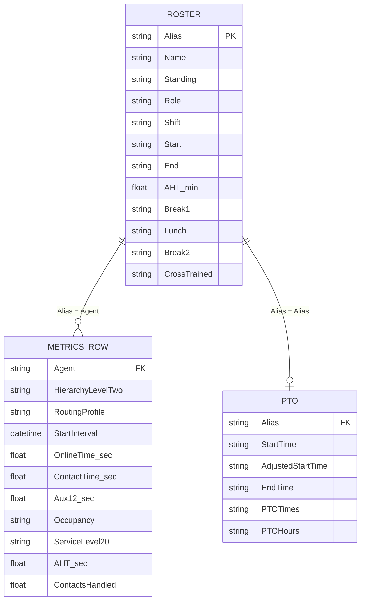
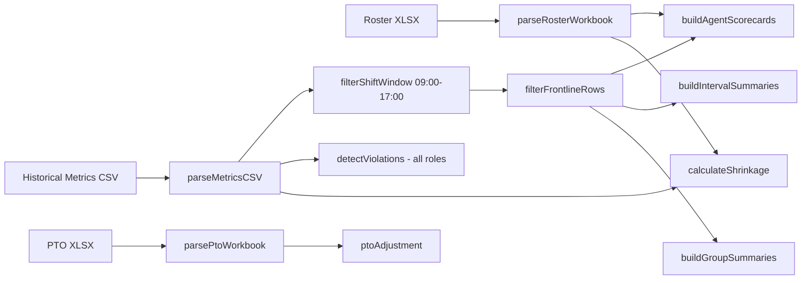

# Data Model

Three inputs, one join key, one analysis pipeline. All examples use the synthetic files in `sample-data/`.

## Entities



Grain:

```
┌──────────────┬──────────────────────────────────────────────────────────┐
│ Roster       │ 1 row per agent per day                                  │
│ PTO          │ 1 row per agent with PTO that day                        │
│ Metrics      │ 1 row per agent × routing profile × 30-minute interval   │
└──────────────┴──────────────────────────────────────────────────────────┘
```

## Relationships

```
Daily Roster (xlsx)                        Historical Metrics (csv)
┌──────────────────┐                       ┌──────────────────────────┐
│ Alias ◄──────────┼────── join ───────────┼─► Agent                  │
│ Name             │                       │ Agent Hierarchy Level Two│
│ Role ────────────┼── group by ──┐        │ Routing Profile ─── filter / group by
│ Shift            │              │        │ StartInterval ───── window + bucket
│ Start / End ─────┼── scheduled minutes   │ Online time              │
│ AHT (min) ◄──────┼── compare ───┼────────┼─► Average handle time    │
│ Break 1/Lunch/B2 │  (reference only)     │ 12 aux columns           │
│ Cross Trained ───┼── group by ──┘        │ Agent on contact time    │
└──────────────────┘                       │ Occupancy                │
                                           │ Service level 20 seconds │
PTO Associates (xlsx)                      │ Contacts handled         │
┌──────────────────┐                       └──────────────────────────┘
│ Alias ◄──────────┼── join (same key)
│ PTO Times/Hours ─┼── reduces scheduled capacity
│ Adjusted Start   │
└──────────────────┘
```

Scheduled break and lunch times in the roster are carried through for reference. They are **not** checked against the metrics' break and lunch seconds, because the export gives seconds per interval, not start times.

## Join behaviour

`mergeRosterMetrics()` is a full outer join on the normalized key (`trim().toLowerCase()`):

```
┌───────────────┬──────────────────────────────────────┬────────┐
│ Status        │ Meaning                              │ Sample │
├───────────────┼──────────────────────────────────────┼────────┤
│ matched       │ on roster, has metrics rows          │     18 │
│ roster-only   │ scheduled, no metrics rows           │      2 │
│ metrics-only  │ has metrics, not on the day's roster │      2 │
└───────────────┴──────────────────────────────────────┴────────┘
```

Metrics-only agents are still scored. They show role `(not on roster)` and have no AHT baseline.

## Pipeline



## Which rows each view uses

```
┌─────────────────────────────┬───────────────────────┬─────────────────────────┐
│ View                        │ Shift window          │ Non-frontline excluded  │
├─────────────────────────────┼───────────────────────┼─────────────────────────┤
│ Dashboard KPIs, Scorecards, │ yes                   │ yes (toggle)            │
│ Intervals, Capacity, Team   │                       │                         │
│ Violations                  │ no                    │ no                      │
│ Roster join, Shrinkage, PTO │ no                    │ no                      │
└─────────────────────────────┴───────────────────────┴─────────────────────────┘
```

Sample effect: 272 rows → 272 in window → **244** after the non-frontline exclusion. The 28 excluded rows are 11 `Lead`/`Lead`, 5 `Lead`/`Escalation Queue`, 8 `Tenured`/`Escalation Queue` and 4 `Tenured`/`Spanish Escalation`.
